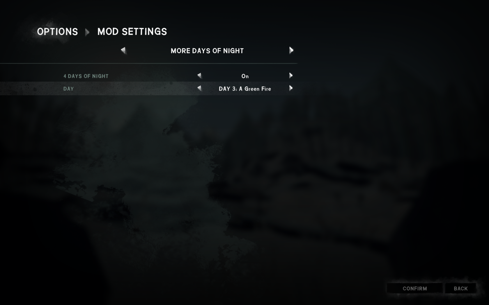
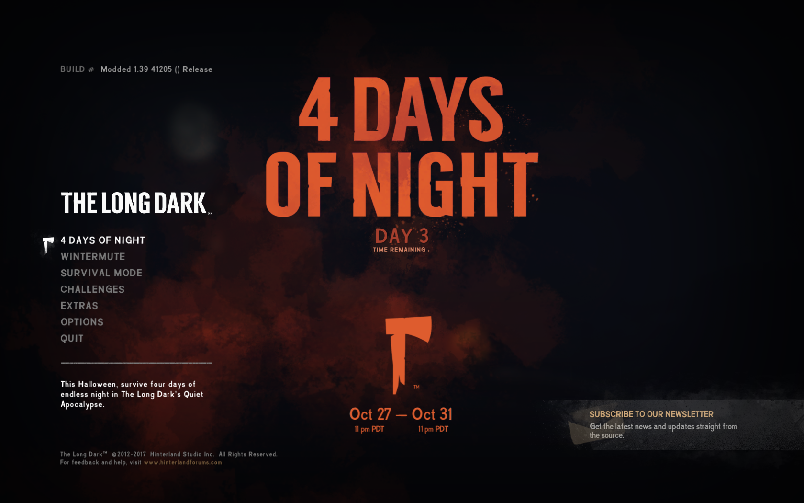

# MoreDaysOfNight

A mod for The Long Dark that lets you play the "4 Days of Night" halloween event.

## Installation

1. If you haven't done so already, install the [Mod Loader](https://github.com/zeobviouslyfakeacc/ModLoaderInstaller)
2. If you haven't done so already, install [ModSettings](https://github.com/zeobviouslyfakeacc/ModSettings) v1.1 or newer
3. Download the latest version of `MoreDaysOfNight.dll` from the [releases page](https://github.com/zeobviouslyfakeacc/MoreDaysOfNight/releases)
4. Move `MoreDaysOfNight.dll` into the mods folder in your TLD install directory
5. Download `4DoN_Scenes_Copy_Into_tld_Data.zip` from the [releases page](https://github.com/zeobviouslyfakeacc/MoreDaysOfNight/releases)
6. Extract the files in `4DoN_Scenes_Copy_Into_tld_Data.zip` into the `tld_Data` folder in your TLD install directory.  
   (A file called `XYZ` in the ZIP archive needs to end up at `TheLongDark/tld_Data/XYZ`)
7. Confirm that you want to overwrite the file called `globalgamemanagers`.  
   If you're not asked for confirmation, you probably didn't extract the files into the correct directory. See **6.**

## Instructions

1. Go to the main menu
2. Select "Options", then "Mod Settings"
2. Navigate to the "More Days of Night" tab
3. Enable the mod and select the desired 4DoN day:

   
4. Press the "Confirm" button
5. Go back to the main menu and start a 4DoN game:

   

You can also change the 4DoN day while in-game: Just press the escape key and follow steps 2 - 5.
